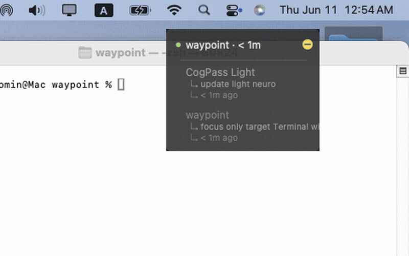

# Waypoint

A minimal macOS floating window that tracks active Claude Code sessions and shows resume hints for each project.

## What it does

- Detects open Claude Code terminal sessions automatically
- Shows the last context/hint for each project
- Click any project to jump to that terminal
- ✓ marks sessions that recently ended

## Demo



## Why I built it

Switching between multiple Claude Code sessions means constantly losing track of where you left off in each project. I wanted something that stays out of the way but always answers "what was I doing here?" — so I built a small floating window that reads your open terminals, infers context from git state, and lets you jump back with one click.

## Install

```
git clone https://github.com/AgnesChen99/waypoint
cd waypoint
pip install -r requirements.txt
```

## Run

```
python main.py
```

## Config

`config.yaml` is optional. Without it, any directory with an active terminal session appears automatically using the folder name. Add entries to give projects friendly display names:

```yaml
projects:
  - name: My App
    path: ~/code/my-app
```

## Roadmap

- [ ] Git root detection for subdirectory support
- [ ] Multi-monitor support

## Built with

Python, tkinter, AppleScript
